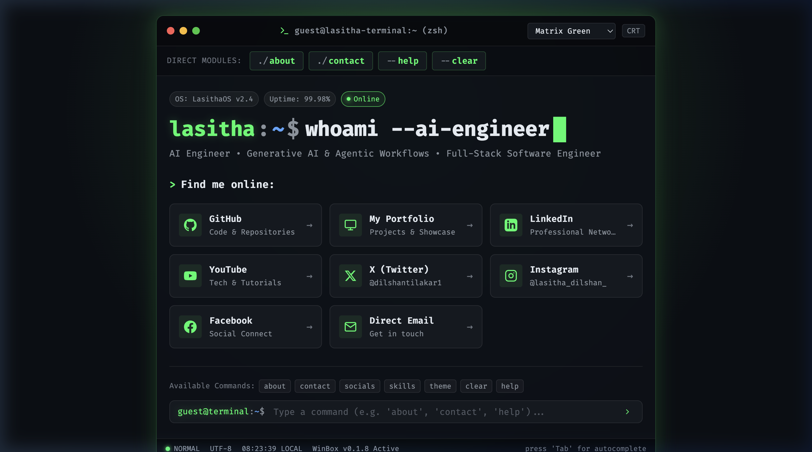
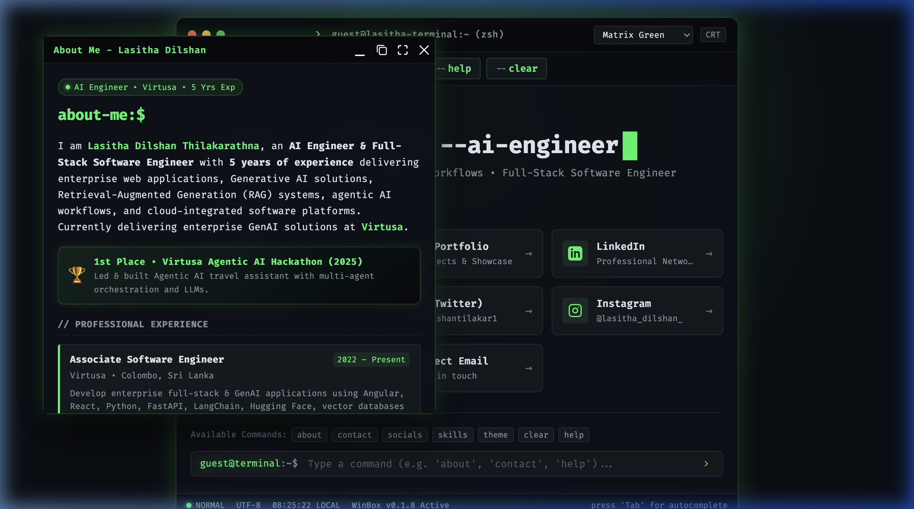
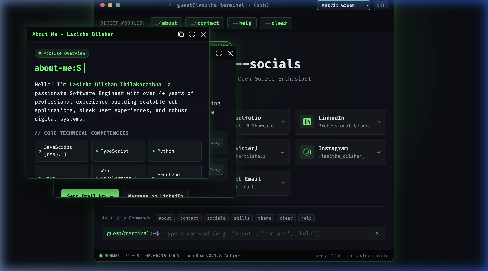

# 💻 Terminal Landing Page

[](LICENSE)
[](https://lasithadilshan.github.io/terminal-landing-page.github.io/)
[](CONTRIBUTING.md)
[](https://github.com/lasithadilshan/terminal-landing-page.github.io/releases)
[](#tech-stack)

An ultra-sleek, interactive terminal-style developer portfolio and landing page built with pure HTML, modern CSS, Vanilla JavaScript, and [WinBox.js](https://github.com/nextapps-de/winbox).

🔗 **Live Demo:** [https://lasithadilshan.github.io/terminal-landing-page.github.io/](https://lasithadilshan.github.io/terminal-landing-page.github.io/)

---

## 📸 Previews

### 1. Terminal Shell & Direct Modules


### 2. Interactive About Modal (CV & Competencies)


### 3. Window Manager & Cascading Modals


---

## ✨ Features

- 🖥️ **Authentic Terminal Interface**: Unix/macOS-styled window controls, terminal titlebar, system status indicators, and live local status clock.
- ⚡ **Interactive Command Line (CLI)**:
  - Execute commands directly (`about`, `contact`, `socials`, `skills`, `theme`, `crt`, `date`, `whoami`, `clear`, `help`).
  - Command history navigation with <kbd>↑</kbd> and <kbd>↓</kbd> arrow keys.
  - Tab autocomplete for available commands.
  - Clickable quick-command chips for touch and mouse navigation.
- 🪟 **Enhanced WinBox.js Modals**:
  - **Singleton Window Management**: Avoids overlapping duplicates or blank windows when buttons are pressed repeatedly.
  - **Mobile Responsive**: Dynamically calculates window coordinates and dimensions to guarantee perfect rendering on smartphones and tablets.
  - **Keyboard Accessible**: Press <kbd>Esc</kbd> anytime to dismiss active windows.
- 🎨 **Multi-Theme Engine**:
  - Switch between **Matrix Green**, **Cyber Neon**, **Amber Phosphor**, and **Dracula Purple**.
  - Persistent user preference saved via `localStorage`.
- 📺 **CRT Retro Phosphor Toggle**: Optional scanline flicker overlay for retro aesthetics.
- 📋 **One-Click Clipboard**: Instant copy for contact details (email and phone number) with animated feedback toasts.
- 🚀 **High Performance & Zero Build Steps**: No frameworks or bundlers required. Optimized Critical Rendering Path with preconnected Google Fonts, deferred scripts, and asset cache-busting.
- ♿ **Accessible**: WCAG AAA compliant contrast, semantic buttons, ARIA labels, and skip-link navigation.

---

## ⌨️ CLI Commands

| Command | Description |
| :--- | :--- |
| `about` or `./about` | Open the interactive **About Me** window with professional background & skills |
| `contact` or `./contact` | Open the **Contact Me** window with direct phone and email channels |
| `socials` or `ls` | Scroll to and focus on online profiles and portfolio links |
| `skills` | Display core technical proficiencies |
| `theme <name>` | Switch color theme (`matrix`, `cyberpunk`, `amber`, `dracula`) |
| `crt` | Toggle retro CRT scanline effect on/off |
| `whoami` | Print a quick summary of the developer |
| `date` | Display the current date and local time |
| `close` or `exit` | Close all active modal windows |
| `clear` or `cls` | Clear command input field |
| `help` or `--help` | List all available terminal commands |

---

## 🛠️ Tech Stack

- **Markup**: Semantic HTML5 with SEO meta tags & OpenGraph support
- **Styles**: Modern CSS3 (CSS Custom Properties, Glassmorphism, Grid/Flexbox, Animations)
- **Logic**: Vanilla JavaScript (ES6+)
- **Window Manager**: [WinBox.js v0.1.8](https://github.com/nextapps-de/winbox)
- **Typography**: Google Fonts ([Fira Code](https://fonts.google.com/specimen/Fira+Code) & [Roboto Mono](https://fonts.google.com/specimen/Roboto+Mono))
- **Hosting**: GitHub Pages

---

## 🚀 Getting Started

No build process, package installations, or dependencies are required.

### 1. Clone the repository
```bash
git clone https://github.com/lasithadilshan/terminal-landing-page.github.io.git
cd terminal-landing-page.github.io
```

### 2. Run locally
You can open `index.html` directly in your browser, or start a local HTTP server:

**Using Python 3:**
```bash
python3 -m http.server 8000
```
Open [http://localhost:8000](http://localhost:8000) in your browser.

**Using Node.js (`npx serve`):**
```bash
npx serve .
```

---

## 📂 Project Structure

```text
terminal-landing-page.github.io/
├── .github/              # GitHub issue templates and workflows
├── css/
│   └── style.css         # Theme tokens, terminal layout, CRT filter & WinBox styles
├── img/
│   └── favicon.ico       # Website favicon
├── js/
│   ├── main.js           # CLI parser, theme manager, window lifecycle & events
│   └── winbox.bundle.js  # WinBox.js library bundle
├── CODE_OF_CONDUCT.md   # Community guidelines
├── CONTRIBUTING.md      # Contribution guidelines
├── LICENSE              # MIT License
├── README.md            # Project documentation
└── index.html           # Main markup & modal templates
```

---

## 🎨 Customization

1. **Profile & Links**: Edit the social links, email, and phone number inside `index.html`.
2. **About Section**: Modify `#about-content` in `index.html` to update your experience, projects, and skills.
3. **Themes**: Add or customize color variables in `:root` and `[data-theme="..."]` in `css/style.css`.
4. **Commands**: Add new terminal commands in `executeCommand()` inside `js/main.js`.

---

## 🤝 Contributing

Contributions, issues, and feature requests are welcome! Please check the [Contributing Guidelines](CONTRIBUTING.md) before submitting a pull request.

---

## 📄 License

This project is open-source and licensed under the [MIT License](LICENSE).
